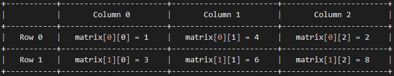

# Multidimensional arrays 📰
## What are multidimensional arrays?
In the previous section, we looked at arrays and how they work. These were one-dimensional arrays (Single dimension arrays), but in C, we can create and use multidimensional arrays. if you want to store data as a tabular form, like a table with rows and columns, you need to get familiar with multidimensional arrays.<br>
A multidimensional array is basically an array of arrays that can have any number of dimensions.
```
tipo arrayName[size1][size2]...[sizeN];
```

For example:
```
// Declare a multidimensional array without initialization.
int foo[1][2][3];

// Declare a multidimensional array with initialization.
char vowels[1][5] = {'a', 'e', 'i', 'o', 'u'};
```

## Two-Dimensional arrays.
The simplest form of multidimensional array is the two-dimensional array. This type of array is also known as a matrix (A table of rows and columns) and is basically a list of one-dimensional arrays.<br>
To declare a two-dimensional integer array of size [x][y], you proceed as follows:
```
// Declare an array of x rows and y columns.
type arrayName[x][y];
```
Where:
- `type` can be any C data type (`int`, `char`, `long`, `double`, etc.)
- `arrayName` will be a valid C identifier.
- `x` and `y` represent the indices that identify each element of the array.

An example of this could be:
```
// Declare an array of 2 rows and 3 columns.
int matrix[2][3] = {{1, 4, 2}, {3, 6, 8}};
```

> The first dimension represents the number of rows [2], while the second dimension represents the number of columns [3]. It can be visualized as follows:
>
> 

## Initializing Two-dimensional arrays.
Multidimensional arrays can be initialized using values enclosed in braces `{}` and separated by commas `,`. Let's see an example that has 3 rows and 4 columns:
```
// Declare an array of 3 rows and 4 colums.
int matrix[3][4] = {
    {0, 1, 2, 3},                                           // Initializers for the row with index 0.
    {4, 5, 6, 7},                                           // Initializers for the row with index 1.
    {8, 9, 10, 11}                                          // Initializers for the row with index 2.
};
```
> Something to keep in mind: Internal braces are not necessary (They are **optional**) The following initialization is the same to the previous example:
> ```
> // Declare an array of 3 rows and 4 colums.
> int matrix[3][4] = {0,1,2,3,4,5,6,7,8,9,10,11};
> ```

## Access the elements of a two-dimensional array.
To access an element of a two-dimensional array, you must specify the index number of the row and the column. For example:
```
#include <stdio.h>

int main() {
    // Declare an array of 2 rows and 3 columns.
    int matrix[2][3] = {{1, 4, 2}, {3, 6, 8}};

    // Print the value in console.
    printf("The value is: %d", matrix[0][1]);               // Prints the value: 4.

    return 0;
}
```
> Remember that array indexes start with 0.

## Change elements of a two-dimensional array.
To change the value of an element, you must specify the index number as follows:
```
#include <stdio.h>

int main() {
    // Declare an array of 2 rows and 3 columns.
    int matrix[2][3] = {{1, 4, 2}, {3, 6, 8}};              // matrix[0][0] is: 1.
    // Change the element at row 0 and column 0.
    matrix[0][0] = 9;                                       // Now matrix[0][0] is: 9.

    // Print the element of row 0 and column 0.
    printf("The value is: %d", matrix[0][0]);               // Prints the value: 9.

    return 0;
}
```

## References.
- Learn-C: https://www.learn-c.org/en/Multidimensional_Arrays
- W3schools: https://www.w3schools.com/c/c_arrays_multi.php