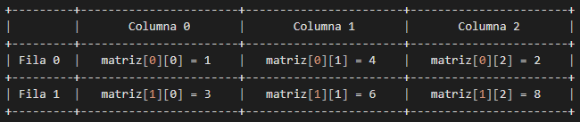

# Arreglos multidimensional 📰
## ¿Qué son los arreglos multidimensional?
En la anterior sección se vio arreglos y cómo funcionan. Estos eran arreglos unidimensional (De una sola dimensión), pero en C podemos crear y usar arreglos multidimensionales. Si se desea almacenar datos de forma tubular, como una tabla con filas y columnas, debemos familiarizarnos con este último.<br>
Una matriz multidimensional es, básicamente, un arreglo de matrices que pueden tener cualquier número de dimensiones.
```c
tipo nombreDeArreglo[tamaño1][tamaño2]...[tamañoN];
```

Por ejemplo:
```c
// Declarar un arreglo multidimensional sin inicializacion.
int foo[1][2][3];

// Declarar un arreglo multidimensional con inicializacion.
char vocales[1][5] = {'a', 'e', 'i', 'o', 'u'};
```

## Matrices bidimensionales.
La forma más simple de arreglos multidimensionales son las matrices bidimensionales (De dos dimensiones) Este tipo de arreglo es también conocido como matriz (Una tabla de filas y columnas) y son, básicamente, una lista de arreglos unidimensionales.<br>
Para declarar un arreglo bidimensional de enteros de tamaño [x][y], se procede de la siguiente manera:
```c
// Declarar un arreglo de x filas e y columnas.
tipo nombreDeArreglo[x][y];
```
Donde: 
- `tipo` puede ser cualquier tipo de dato de C (`int`, `char`, `long`, `doble`, etc.)
- `nombreDeArreglo` será un identificador válido en C.
- `x` e `y` representará los índices que identifica cada elemento del arreglo.

Un ejemplo de esto puede ser:
```c
// Declarar un arreglo de 2 filas y 3 columnas.
int matriz[2][3] = {{1, 4, 2}, {3, 6, 8}};
```

> La primera dimensión representa el número de filas [2], mientras que la segunda dimensión representa el número de columnas [3] Se puede visualizar de la siguiente manera:
>
> 

## Inicializar arreglos bidimensionales.
Los arreglos multidimensionales pueden ser inicializados usando valores encerrados entre llaves `{}` y separados por comas `,`. Veamos un ejemplo que posee 3 filas y 4 columnas:
```c
// Declarar un arreglo de 3 filas y 4 columnas.
int matriz[3][4] = {
    {0, 1, 2, 3},                                           // Inicializadores para la fila con índice 0.
    {4, 5, 6, 7},                                           // Inicializadores para la fila con índice 1.
    {8, 9, 10, 11}                                          // Inicializadores para la fila con índice 2.
};
```
> Algo a tener en cuenta: No son necesarias las llaves internas (Son **opcionales**). La siguiente inicialización es la misma a la del ejemplo anterior.
> ```c
> // Declarar un arreglo de 3 filas y 4 columnas.
> int matriz[3][4] = {0,1,2,3,4,5,6,7,8,9,10,11};
> ```

## Acceso a los elementos de un arreglo bidimensional.
Para tener acceso a un elemento de una matriz bidimensional, se debe especificar el índice numérico de la fila y la columna. Por ejemplo:
```c
// Declarar un arreglo de 2 filas y 3 columnas.
int matriz[2][3] = {{1, 4, 2}, {3, 6, 8}};

// Imprimir el valor en consola.
printf("El valor es: %d", matriz[0][1]);                    // Imprime el valor: 4.
```
> Recordar que los índices de los arreglos comienzan con 0.

## Cambiar elementos de un arreglo bidimensional.
Para cambiar el valor de un elemento, se debe realizar indicando el número de índice de la siguiente manera:
```c
// Declarar un arreglo de 2 filas y 3 columnas.
int matriz[2][3] = {{1, 4, 2}, {3, 6, 8}};                  // matriz[0][0] es: 1.
// Cambiar el elemento de la fila 0 y columna 0.
matriz[0][0] = 9;                                           // Ahora matriz[0][0] es: 9.

// Imprimir el elemento de la fila 0 y columna 0.
printf("El valor es: %d", matriz[0][0]);                    // Imprime el valor: 9.
```

## Bibliografía.
- Learn-C: https://www.learn-c.org/es/Multidimensional_Arrays
- W3schools: https://www.w3schools.com/c/c_arrays_multi.php